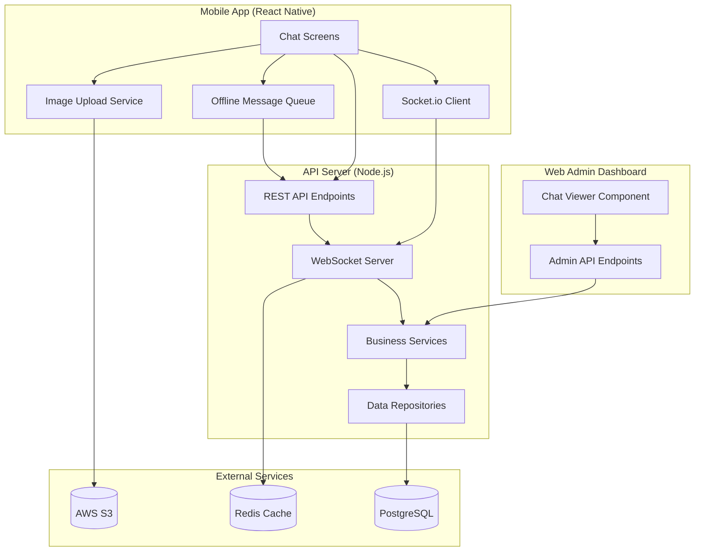

# Messaging System Architecture

## System Overview

The messaging system is built on a microservices-inspired architecture within the monorepo, providing real-time communication between customers and artists. It follows an Airbnb-style conversation model where one persistent chat thread exists per artist-customer pair.

## High-Level Architecture



## Data Model

### Core Entities

#### Conversations
```sql
CREATE TABLE conversations (
  id UUID PRIMARY KEY DEFAULT gen_random_uuid(),
  booking_id UUID REFERENCES bookings(id),
  customer_id UUID NOT NULL REFERENCES users(id),
  artist_id UUID NOT NULL REFERENCES users(id),
  status VARCHAR(20) DEFAULT 'active',
  last_message_at TIMESTAMP NOT NULL,
  unread_count_customer INTEGER DEFAULT 0,
  unread_count_artist INTEGER DEFAULT 0,
  archived_at TIMESTAMP,
  created_at TIMESTAMP DEFAULT NOW(),
  updated_at TIMESTAMP DEFAULT NOW()
);
```

#### Messages
```sql
CREATE TABLE messages (
  id UUID PRIMARY KEY DEFAULT gen_random_uuid(),
  conversation_id UUID NOT NULL REFERENCES conversations(id),
  sender_id UUID NOT NULL REFERENCES users(id),
  sender_role VARCHAR(20) NOT NULL,
  message_type VARCHAR(20) DEFAULT 'text',
  content TEXT,
  images JSONB,
  booking_id UUID REFERENCES bookings(id),
  sent_at TIMESTAMP DEFAULT NOW(),
  read_at TIMESTAMP,
  created_at TIMESTAMP DEFAULT NOW()
);
```

### Key Design Decisions

1. **Conversation Scope**: One conversation per artist-customer pair (Airbnb model)
   - Reduces fragmentation across multiple bookings
   - Maintains conversation context and history
   - Simplifies UI and user experience

2. **Message Types**: Support for text, images, and system messages
   - Extensible for future media types (voice, video, etc.)
   - System messages for booking status updates
   - Structured data with JSONB for flexible metadata

3. **Read Receipts**: Per-message read tracking
   - Supports delivery confirmations
   - Enables "read" status indicators
   - Tracks conversation engagement

## Component Architecture

### Backend Services

#### ConversationService
- **Responsibilities**:
  - Conversation lifecycle management
  - Access control validation
  - Unread count calculations
  - Archive/soft-delete operations

- **Key Methods**:
  ```typescript
  getOrCreateConversation(customerId, artistId, bookingId?)
  getUserConversations(userId, role, pagination)
  validateConversationAccess(conversationId, userId)
  markAsRead(conversationId, userId, role)
  ```

#### MessageService
- **Responsibilities**:
  - Message CRUD operations
  - Real-time broadcasting via WebSocket
  - System message generation
  - Pagination and filtering

- **Key Methods**:
  ```typescript
  sendMessage(messageData)
  getMessages(conversationId, userId, pagination)
  markMessageAsRead(messageId, userId)
  sendSystemMessage(conversationId, content, bookingId)
  ```

#### WebSocket Service
- **Responsibilities**:
  - Connection management and authentication
  - Room-based message distribution
  - Typing indicators and presence
  - Connection state recovery

- **Socket Events**:
  ```typescript
  // Client → Server
  join:conversation, message:send, typing:start, message:read

  // Server → Client
  message:new, message:delivered, message:read, user:typing
  ```

### Frontend Architecture

#### React Query Integration
```typescript
// Hooks for data fetching
useConversations(userRole)
useConversation(conversationId)
useMessages(conversationId)
useSendMessage()
useUnreadCount(userRole)
```

#### Socket.io Client
```typescript
// Connection management
useSocket() // Returns socket instance and connection state

// Automatic reconnection
// Room management
// Real-time updates
```

#### Offline Queue
```typescript
// AsyncStorage-based persistence
OfflineMessageQueue.getInstance().enqueueMessage(message)
OfflineMessageQueue.getInstance().processQueue(sendFunction)
```

### Mobile UI Architecture

#### Screen Structure
```
ChatsListScreen
├── ConversationListItem[]
└── Pull-to-refresh + infinite scroll

ChatScreen
├── GiftedChat
├── Image picker
├── Typing indicators
└── Message status indicators
```

#### Navigation Flow
```
BookingDetailScreen → ChatScreen (with booking context)
ArtistBookingDetailScreen → ChatScreen (with booking context)
WelcomeScreen → ChatsListScreen → ChatScreen
```

## Security Architecture

### Authentication
- JWT-based WebSocket authentication
- Token validation on connection
- Session invalidation support
- Role-based access control

### Authorization
- Conversation ownership validation
- Message sender verification
- Admin role checking for oversight
- File upload permissions

### Data Protection
- Transport layer security (TLS)
- Input validation and sanitization
- SQL injection prevention
- XSS protection in chat content

## Performance Architecture

### Database Optimization
```sql
-- Conversation lookup indexes
CREATE INDEX idx_conversations_customer ON conversations(customer_id, last_message_at DESC);
CREATE INDEX idx_conversations_artist ON conversations(artist_id, last_message_at DESC);
CREATE INDEX idx_conversations_lookup ON conversations(customer_id, artist_id);

-- Message pagination indexes
CREATE INDEX idx_messages_conversation ON messages(conversation_id, sent_at DESC);
CREATE INDEX idx_messages_booking ON messages(booking_id) WHERE booking_id IS NOT NULL;
```

### Caching Strategy
- Redis for active conversation metadata
- In-memory caching for unread counts
- CDN for image delivery
- Browser cache for static assets

### Scaling Considerations
- WebSocket horizontal scaling with Redis adapter
- Database read replicas for message history
- Message sharding by conversation ID
- Load balancer sticky sessions for WebSocket

## Integration Points

### Booking System Integration
```typescript
// Automatic system messages on booking status changes
BookingService.updateBookingStatus() → MessageService.sendSystemMessage()

// Conversation creation from booking screens
BookingDetailScreen → Navigation → ChatScreen → getOrCreateConversation()
```

### User Authentication Integration
```typescript
// JWT token passing to WebSocket
useAuthStore().token → Socket.io auth handshake

// Role-based conversation access
user.roles → ConversationService.validateAccess()
```

### Admin Dashboard Integration
```typescript
// Read-only chat viewer
AdminAPI → ConversationService → MessageService

// Audit logging
AdminAPI → AuditLogRepository.createAuditLog()
```

## Error Handling

### Client-Side Errors
- Network connectivity issues → Offline queue
- Authentication failures → Re-login prompts
- Message send failures → Retry UI
- Image upload errors → Fallback to text-only

### Server-Side Errors
- Database connection issues → Graceful degradation
- WebSocket connection drops → Automatic reconnection
- File upload failures → Error logging and cleanup
- Invalid requests → Proper HTTP status codes

## Monitoring and Observability

### Metrics
- WebSocket connection count and duration
- Message send/receive latency
- Image upload success/failure rates
- Database query performance
- Error rates by component

### Logging
- Structured logging with context
- Audit trails for admin access
- Performance monitoring
- Error tracking with stack traces

### Alerts
- WebSocket connection failures > 5%
- Message delivery latency > 2 seconds
- Database query timeouts
- File upload failures > 10%

## Deployment Architecture

### Development Environment
- Local PostgreSQL and Redis
- Self-signed certificates for HTTPS
- Hot reload for rapid development
- Comprehensive test suites

### Production Environment
- Managed PostgreSQL cluster
- Redis cluster for caching/scaling
- AWS S3 with CloudFront CDN
- Load balancers with SSL termination
- Monitoring and alerting stack

### CI/CD Pipeline
- Automated testing on pull requests
- Database migration checks
- Security scanning
- Performance regression testing
- Blue-green deployments

This architecture provides a scalable, maintainable, and user-friendly messaging system that integrates seamlessly with the existing 524 platform while providing room for future enhancements.
