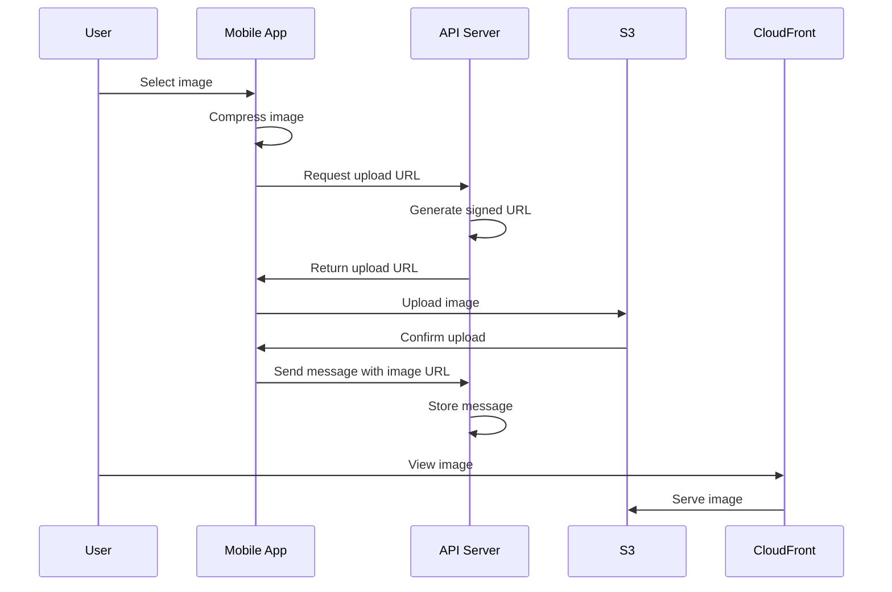

# Media Handling

## Overview

The messaging system supports image sharing with client-side compression, secure S3 storage, and optimized delivery. Images are automatically compressed before upload and delivered via CDN for fast loading.

## Architecture

### Upload Flow



### Storage Structure

Images are organized in S3 with a structured path:

```
chat/{conversationId}/{timestamp}_{randomId}.{extension}
```

Example:
```
chat/conv-12345/1640995200000_abc123.jpg
```

## Client-Side Processing

### Image Compression

Images are compressed on-device before upload:

```typescript
// packages/mobile/src/utils/imageCompression.ts
export interface ImageCompressionOptions {
  maxWidth?: number;    // Default: 1920px
  maxHeight?: number;   // Default: 1920px
  quality?: number;     // Default: 0.8 (80%)
  format?: SaveFormat;  // Default: JPEG
}

export async function compressImageForMessaging(
  imageUri: string,
  options: ImageCompressionOptions = {}
): Promise<CompressedImageResult> {
  const compressed = await manipulateAsync(imageUri, [
    {
      resize: {
        width: options.maxWidth || 1920,
        height: options.maxHeight || 1920,
      },
    },
  ], {
    compress: options.quality || 0.8,
    format: options.format || SaveFormat.JPEG,
  });

  return {
    uri: compressed.uri,
    width: compressed.width,
    height: compressed.height,
    fileName: generateFileName(),
  };
}
```

### Upload Service

The upload process handles compression and S3 upload:

```typescript
// packages/mobile/src/services/imageUploadService.ts
export async function processAndUploadImage(
  imageUri: string,
  conversationId: string
): Promise<UploadImageResult> {
  // Compress image
  const compressedImage = await compressImageForMessaging(imageUri);

  // Validate constraints
  validateImageConstraints(compressedImage.width, compressedImage.height);

  // Get signed upload URL
  const { data: uploadData } = await apiClient.post('/messaging/upload-image', {
    fileName: compressedImage.fileName,
    fileType: 'image/jpeg',
    conversationId,
  });

  // Upload to S3
  await uploadToS3(uploadData.uploadUrl, compressedImage.uri, 'image/jpeg');

  return {
    publicUrl: uploadData.publicUrl,
    key: uploadData.key,
  };
}
```

## Server-Side Processing

### Signed URL Generation

The API generates secure signed URLs for S3 upload:

```typescript
// packages/api/src/services/uploadService.ts
export async function uploadMessageImage(params: {
  fileName: string;
  fileType: string;
  conversationId: string;
  userId: string;
}): Promise<UploadImageResult> {
  // Validate file type
  if (!ALLOWED_TYPES.includes(fileType.toLowerCase())) {
    throw new Error('Invalid file type');
  }

  // Generate unique key
  const key = generateS3Key(conversationId, fileName);

  // Create signed URL
  const putCommand = new PutObjectCommand({
    Bucket: process.env.AWS_S3_BUCKET,
    Key: key,
    ContentType: fileType,
    ACL: 'public-read',
    Metadata: {
      uploadedBy: userId,
      conversationId,
    },
  });

  const uploadUrl = await getSignedUrl(s3Client, putCommand, {
    expiresIn: 300, // 5 minutes
  });

  const publicUrl = `https://${bucket}.s3.${region}.amazonaws.com/${key}`;

  return { uploadUrl, key, publicUrl };
}
```

### Access Control

Upload URLs are validated for conversation access:

```typescript
// Verify user has access to conversation
const hasAccess = await conversationService.validateConversationAccess(
  conversationId,
  userId
);

if (!hasAccess) {
  throw new Error('Access denied to conversation');
}
```

## Storage Configuration

### S3 Bucket Setup

```terraform
resource "aws_s3_bucket" "chat_media" {
  bucket = "524-chat-media"

  cors_rule {
    allowed_headers = ["*"]
    allowed_methods = ["PUT", "POST"]
    allowed_origins = ["https://app.524beauty.com"]
    max_age_seconds = 3000
  }
}

resource "aws_s3_bucket_public_access_block" "chat_media" {
  bucket = aws_s3_bucket.chat_media.id

  block_public_acls       = false
  block_public_policy     = false
  ignore_public_acls      = false
  restrict_public_buckets = false
}
```

### CloudFront Distribution

```terraform
resource "aws_cloudfront_distribution" "chat_media" {
  origin {
    domain_name = aws_s3_bucket.chat_media.bucket_regional_domain_name
    origin_id   = "S3-chat-media"
  }

  default_cache_behavior {
    allowed_methods  = ["GET", "HEAD", "OPTIONS"]
    cached_methods   = ["GET", "HEAD"]
    target_origin_id = "S3-chat-media"

    forwarded_values {
      query_string = false
      cookies {
        forward = "none"
      }
    }

    viewer_protocol_policy = "redirect-to-https"
    min_ttl                = 0
    default_ttl            = 86400  # 24 hours
    max_ttl                = 31536000  # 1 year
  }

  price_class = "PriceClass_100"
}
```

## Image Display

### Mobile App Rendering

Images are displayed with proper aspect ratio and loading states:

```typescript
// packages/mobile/src/components/messaging/MessageBubble.tsx
const renderImageMessage = (message: Message) => {
  const [imageLoading, setImageLoading] = useState(true);

  return (
    <View style={styles.imageContainer}>
      <FastImage
        source={{ uri: message.images?.[0] }}
        style={styles.image}
        resizeMode="contain"
        onLoadStart={() => setImageLoading(true)}
        onLoadEnd={() => setImageLoading(false)}
      />
      {imageLoading && (
        <View style={styles.imagePlaceholder}>
          <ActivityIndicator />
        </View>
      )}
    </View>
  );
};
```

### Web Admin Display

Images are shown in the admin chat viewer:

```typescript
// packages/web/src/components/chat/MessageBubble.tsx
const renderImage = (imageUrl: string) => (
   openLightbox(imageUrl)}
  />
);
```

## Performance Optimization

### Compression Settings

Different compression levels for different use cases:

```typescript
const COMPRESSION_PRESETS = {
  thumbnail: { maxWidth: 200, maxHeight: 200, quality: 0.7 },
  standard: { maxWidth: 1920, maxHeight: 1920, quality: 0.8 },
  high_quality: { maxWidth: 4096, maxHeight: 4096, quality: 0.9 },
};
```

### Progressive Loading

Images load progressively for better UX:

```typescript
<FastImage
  source={{ uri: imageUrl }}
  resizeMode="cover"
  onLoad={(evt) => {
    // Image loaded successfully
    setImageDimensions({
      width: evt.nativeEvent.width,
      height: evt.nativeEvent.height,
    });
  }}
  onError={() => {
    // Fallback to placeholder
    setImageError(true);
  }}
/>
```

### Caching Strategy

Images are cached at multiple levels:

1. **Device cache**: FastImage caches locally
2. **CDN cache**: CloudFront caches globally
3. **Browser cache**: Standard HTTP caching headers

## Security

### Upload Validation

Multiple layers of validation:

```typescript
const validateImageUpload = (file: {
  name: string;
  type: string;
  size: number;
}) => {
  // File type validation
  if (!ALLOWED_TYPES.includes(file.type)) {
    throw new Error('Invalid file type');
  }

  // File size validation
  if (file.size > MAX_FILE_SIZE) {
    throw new Error('File too large');
  }

  // Filename sanitization
  const cleanName = sanitizeFilename(file.name);
  if (cleanName !== file.name) {
    throw new Error('Invalid filename');
  }
};
```

### Content Moderation

Future content moderation integration:

```typescript
const moderateImage = async (imageUrl: string) => {
  // Send to moderation service
  const moderationResult = await moderateContent(imageUrl);

  if (moderationResult.flagged) {
    // Mark for review or remove
    await flagMessage(messageId, moderationResult.reason);
  }
};
```

## Error Handling

### Upload Failures

Graceful handling of upload errors:

```typescript
try {
  const uploadResult = await processAndUploadImage(imageUri, conversationId);
  await sendMessage({
    messageType: 'image',
    images: [uploadResult.publicUrl],
  });
} catch (error) {
  console.error('Image upload failed:', error);

  // Show user-friendly error
  Alert.alert(
    'Upload Failed',
    'Failed to upload image. Please check your connection and try again.',
    [
      { text: 'Retry', onPress: () => retryUpload() },
      { text: 'Cancel', style: 'cancel' },
    ]
  );
}
```

### Network Issues

Offline queue integration for image uploads:

```typescript
// Queue image uploads when offline
if (!networkState.isConnected) {
  await queueImageUpload(imageUri, conversationId);
  showOfflineNotification();
}
```

## Monitoring

### Upload Metrics

Track upload performance and success rates:

```typescript
const uploadMetrics = {
  totalUploads: 0,
  successfulUploads: 0,
  failedUploads: 0,
  averageUploadTime: 0,
  averageFileSize: 0,
};

const recordUploadMetrics = (success: boolean, duration: number, fileSize: number) => {
  uploadMetrics.totalUploads++;
  if (success) {
    uploadMetrics.successfulUploads++;
  } else {
    uploadMetrics.failedUploads++;
  }

  // Update averages
  uploadMetrics.averageUploadTime =
    (uploadMetrics.averageUploadTime + duration) / uploadMetrics.totalUploads;
  uploadMetrics.averageFileSize =
    (uploadMetrics.averageFileSize + fileSize) / uploadMetrics.totalUploads;
};
```

### Storage Analytics

Monitor S3 usage and costs:

```typescript
const storageMetrics = {
  totalImages: 0,
  totalSizeBytes: 0,
  averageImageSize: 0,
  imagesByConversation: new Map(),
  storageCosts: 0,
};
```

## Cost Optimization

### Storage Classes

Use appropriate S3 storage classes:

```typescript
// Move old images to cheaper storage
const lifecycleRule = {
  ID: 'Move old chat images to IA',
  Status: 'Enabled',
  Prefix: 'chat/',
  Transitions: [
    {
      Days: 30,
      StorageClass: 'STANDARD_IA',
    },
    {
      Days: 90,
      StorageClass: 'GLACIER',
    },
  ],
};
```

### CDN Optimization

Optimize CloudFront for image delivery:

```typescript
const cacheBehavior = {
  PathPattern: 'chat/*',
  Compress: true,
  CachePolicyId: 'image-optimization', // Use AWS managed policy
  OriginRequestPolicyId: 'image-optimization',
};
```

## Testing

### Image Upload Tests

```typescript
describe('Image Upload', () => {
  it('should compress images correctly', async () => {
    const largeImageUri = 'large-image.jpg';
    const compressed = await compressImageForMessaging(largeImageUri);

    expect(compressed.width).toBeLessThanOrEqual(1920);
    expect(compressed.height).toBeLessThanOrEqual(1920);
  });

  it('should upload to S3 successfully', async () => {
    const testImage = 'test-image.jpg';
    const result = await processAndUploadImage(testImage, 'conv-123');

    expect(result.publicUrl).toContain('s3.');
    expect(result.key).toContain('chat/conv-123/');
  });

  it('should handle upload failures gracefully', async () => {
    // Mock network failure
    mockNetworkFailure();

    await expect(
      processAndUploadImage('test.jpg', 'conv-123')
    ).rejects.toThrow('Upload failed');
  });
});
```

### Performance Tests

```typescript
describe('Image Performance', () => {
  it('should compress images within time limits', async () => {
    const startTime = Date.now();
    await compressImageForMessaging('large-image.jpg');
    const duration = Date.now() - startTime;

    expect(duration).toBeLessThan(5000); // 5 seconds max
  });

  it('should maintain image quality', async () => {
    const original = await getImageInfo('original.jpg');
    const compressed = await compressImageForMessaging('original.jpg');

    // Quality should be maintained within acceptable range
    expect(compressed.quality).toBeGreaterThan(0.7);
  });
});
```

## Future Enhancements

### Advanced Features

1. **Video Support**: MP4 and WebM video messages
2. **Voice Messages**: Audio recording and playback
3. **Image Editing**: Crop, rotate, filters before sending
4. **Sticker Packs**: Pre-made images and emojis
5. **Link Previews**: Automatic previews for shared links

### Optimization Improvements

1. **WebP Support**: Modern image format for smaller files
2. **Progressive JPEG**: Better loading experience
3. **Lazy Loading**: Load images only when visible
4. **Offline Caching**: Cache images for offline viewing

This media handling system provides fast, secure, and optimized image sharing for the messaging platform.

